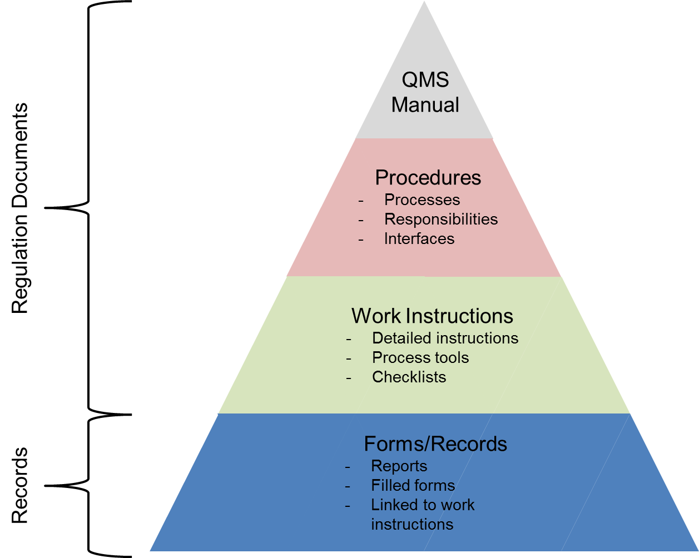

Maybe you’ve been asked to write policy and procedure documents for your organization, especially if you work for a large corporation and/or in a regulated environment such as the pharmaceutical industry. This requires a different kind of orientation than writing product documentation. Your audience and end users are now your work colleagues, and you must focus on ways of communicating how everyone fits in the larger picture of the company’s operations and goals.

### Quality management systems

Often the journey begins with your company’s QMS. Many types of quality regimes exist, but it’s likely you will be working with the ISO 9000 family of standards. Typically your company's quality assurance folks have already defined the QMS with its process landscape. They have mapped and described the main business processes and have either received or are seeking quality certification.

The documentation structure for ISO 9001:2008 typically looks like this:

The QMS Manual at the top is the basis document that refers to all other process documents in your company. It might be a single document containing a linked map or model of the main business processes.

The individual processes themselves should be adequately described by the collection of documents at the next level, “Procedures.” Here, descriptions of processes and responsibilities, including which groups do what, are given. Although this level is called “Procedures,” these are not procedures in a “how to” sense. Instead they describe how processes are implemented from a high level; for example, they show how departments in your organization contribute to a process.

It is the next level, Work Instructions, which is of interest to technical writers, for these kinds of documents are followed and actively read by employees. Work Instructions spell out how people do “business-relevant” work. So for example, an IT department in charge of a data center could have one or more Work Instructions describing:

- Round-the-clock maintenance activities in a general way, e.g., on the basis of Key Performance Indicators.
- Who is responsible for doing which activities. For example, network engineers of XYZ group are responsible for implementing new technologies on a project basis.
- The sequence of departmental approvals required before signing off on work packages.

Note this work is considered business relevant since the process documents of the preceding levels of the QMS had defined it as such. The involved groups might do other kinds of work but these would not necessarily be described or “regulated” by the policies and procedures of the QMS.

So far I’ve been describing the “Regulation Documents” portion of the pyramid. These documents have binding character and require formal validation and approval by company management. The approval process for Work Instructions is typically longer than for other kinds of documents because of the many sign-offs required.

The next level, Records, can comprise a wide range of document types and are supposed to represent evidence that your company is following through on its quality management system. Basically any kind of document defined as business relevant can be called a Record. Examples of Records might be a user manual about how to use an internal accounting system or a set of files showing periodic summaries of KPI data. The important thing about Records is they require express rules for versioning, traceability, and archival. Your quality management system typically defines such rules.

### Writing policies and procedures

First though, it's important to get a solid understanding of your company’s QMS. Try to understand where your business unit fits in the overall process model, as well as the kinds of documents the QMS defines. You should also know how your company differentiates between Regulation Documents and Records, as this can avoid a lot of confusion later.

Although your target audience is well known (they are sitting beside you), policy and procedure documents typically entail a long writing and review process because you must also describe how other groups or departments interact with yours.

A well-written policy document on the Work Instruction level has:

- Clearly expressed purpose, scope, and objectives.
- A good description of your group and its purpose, and how it fits in the company’s process landscape.
- A clear description of the relevant business processes and activities, such as their diverse purposes, inputs, and outputs, and how your group contributes to these processes.
- A glossary of commonly used and agreed on terminology. For example, if you’re describing a business process whose objective is to archive financial transactions, you should define exactly what a transaction is, its components, and its scope.

Once you’ve written your policy document or set of documents, you can describe other related aspects of your organization in greater detail, by producing checklists, related templates, manuals for tools, etc. Don’t forget that the tone of your writing should reflect your business environment.
