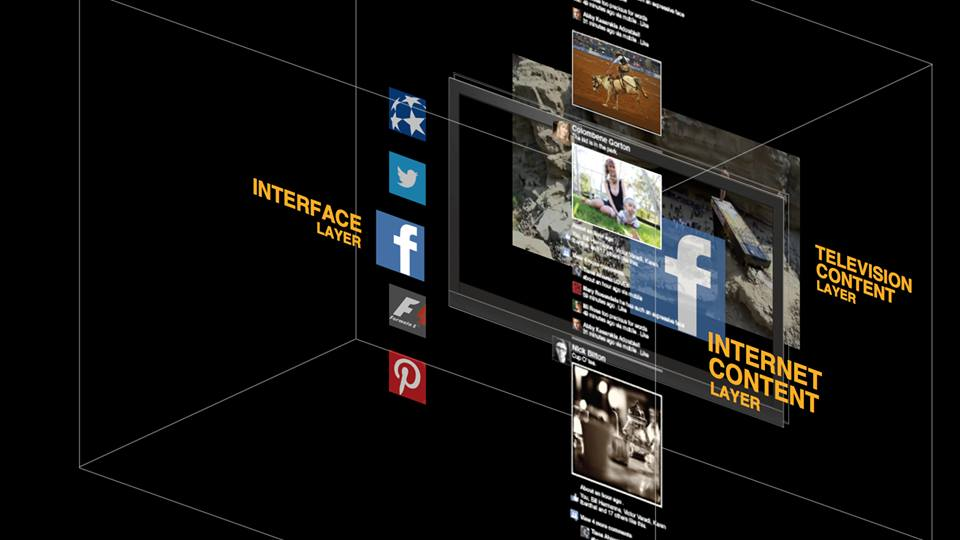
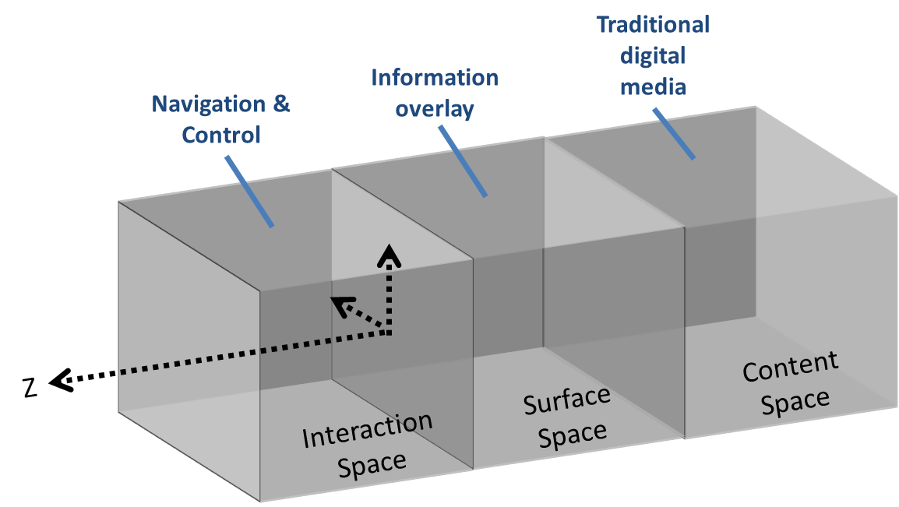

As technologies for 3D displays and gesture control become widespread, we’ll eventually see these technologies incorporated in apps and software that are currently displayed on a 2D screen. At the moment, pioneering work is being done in user interface design for TVs and gaming consoles, and it’s worth looking at what might very well be the future of software user assistance.

I’m not going to write about user assistance as we know it. Instead, I’m going to share some insights from a [masterclass on interaction design](http://www.xmedialab.com/events/2014/interaction-design-principles-processes/) that I attended on June 12. It was given by designer and entrepreneur Dale Herigstad, and hosted by X Media Lab in Zurich.

Herigstad worked in the television and film industry for many years, collaborating on design and branding projects ranging from the augmented reality scenes in the film, “Minority Report,” to stats overlays on American sports programs.

### About interaction design

According to the [Interaction Design Foundation](https://www.interaction-design.org/), interaction design seeks to “shape digital things for peoples’ use.” Alternatively [one could describe](https://books.google.ch/books?id=0gdRAAAAMAAJ&redir_esc=y&hl=en) it as “the practice of designing interactive digital products, environments, systems, and services.” [For software](http://ux.stackexchange.com/questions/43808/what-is-the-difference-between-web-design-interaction-design-user-experience-d), one can define it as the “development of application flows to facilitate user tasks and defining how the user interacts with site functionality.”

Interaction design (IxD) and user experience (UX) are related, though some say interaction design is a subset of UX.

### "Simple, powerful, and engaging"

According to Dale Herigstad, these characteristics make for a successful user interface, of which Apple’s iOS is a great example. Not only do you touch the screen to interact, but you swipe it. Swiping the screen side-to-side is a gesture that exemplifies the kinds of novel hand movements being developed for interacting both on the surface and inside of digital spaces, and it anticipates future interactions with gesture detection systems.

As stereo augmented reality gains in prominence (stereo here broadly meaning 3D imaging systems that sense depth), so will spatial context in design. No longer will we be developing for flat surfaces only.

### Tackling Z Space

He frequently mentioned Z Space (pronounced zed space) as the design area for this 3D spatial context, Z Space referring to the space between you and the screen or device.

In fact, he sees three separate spaces emerging:

- **Content space**, containing traditional media, such as a television programs or games.
- **Surface space** or overlay of digital information, such as stats and advertising during sports programs. Appearance of information in the surface space (foreground) pushes content space back.
- **Interaction space (Z Space)** allows users to control and interact with the previous two spaces, possibly through hand gestures and other movements. Interaction space represents the depth of user engagement between a user and their screen display, and is the focus of Dale’s research.

### Navigating Z Space—gesture control

According to Herigstad, interaction projects have two primary elements: displayed information and user input. In regards to user input, he finds that the human hand is an elegant and efficient tool for interaction space, as it greatly simplifies user engagement and eliminates buttons and other controls.

Swiping motions for smartphones are a first step in gesture control, and Dale believes systems should learn involuntary human gestures and emotions for additional feedback and input.

Although systems like [Microsoft Kinect](https://en.wikipedia.org/wiki/Kinect) have developed their own standards for gesture recognition, he advocates for universal gesture control standards across all systems.

### Interaction design and progressive disclosure

He also showed examples and case studies from his interaction project portfolio. To keep interaction space as simple and intuitive as possible, he recommends the practice of “stepping in,” which we in user assistance recognize as progressive disclosure. This enables users to find related content without cluttering the screen.

One case study of his use of progressive disclosure was the blending of film content in the “Miami Vice” HD-DVD with internet content [to allow tracking of the characters](http://charman-anderson.com/2007/08/09/xmedialab-melbourne-dale-herigstad-and-new-television/) in Google Earth. Users can select characters to pull up their bios or track their whereabouts somewhere in Florida.

### Designing for a post-screen world

Products like Google Glass, Oculus Rift, etc., represent a post-screen world and a new frontier in design. Herigstad listed a number of principles and issues for interaction design for augmented and virtual reality.

- Determine the meaning of Z Space, particularly through stereo 3D (and not just through scaling [2.5D](https://en.wikipedia.org/wiki/2.5D), as often found in the game industry).
- Determine who owns Z Space--is it the brand or the audience, whose interaction overlays the brand, that's in control? Viewers can increasingly interact with content.
- Many designers want to get away from hand navigation inputs, but Dale finds it’s still a perfect tool.
- Determine the proximity of the design elements to each other, and their separation along the z-axis.
- Determine design clarity and what augments what. For example, use of a light foreground on a dark background.
- Define clear layers of overlaying content such as internet, social media, etc.
- The background always represents context. Cluttering and embellishments should be removed to maximum extent.
- Utilize simpler type and fewer colors.

### My thoughts

It was interesting to learn about future directions in design in relation to new technologies in gesture control and augmented and virtual reality. As such systems become more prevalent, interaction design will be an important trend for technical communicators and user experience experts to watch.

Has interaction design impacted your work yet?

