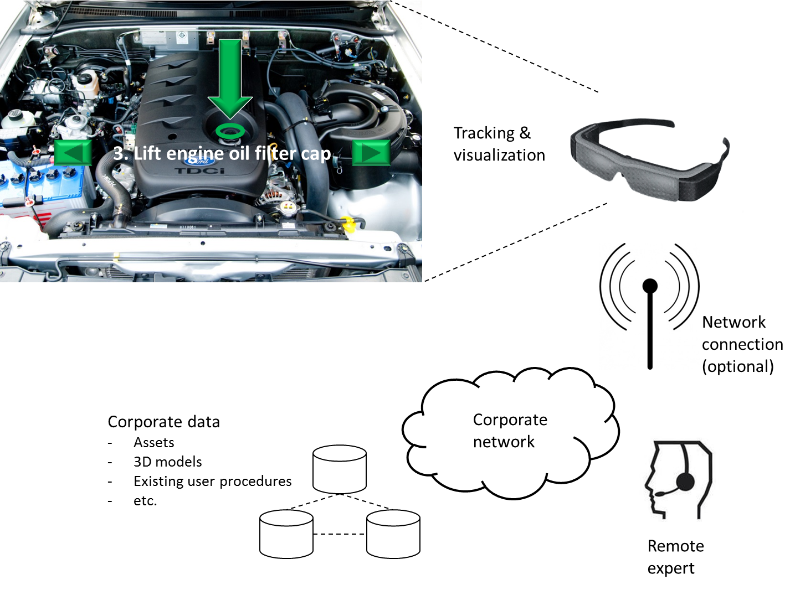

By now you’ve probably heard about augmented reality and its use in gaming and advertising. But the fastest growing segment for augmented reality, according to [Brian Mullins](https://www.youtube.com/watch?v=9YHCSqgH7YM) of augmented reality company DAQRI, is in the industrial vertical where use cases for training and maintenance abound.

Mobile augmented reality applications project virtual elements onto your camera view of real-world objects in order to enhance your experiences. This augmentation results in a composed scene that must be developed in advance so that digital assets are correctly integrated into your perspective.

### What augmented reality brings

A well-implemented mobile AR help system can bring benefits to users, as borne out by [research in this area](http://www.sciencedirect.com/science/article/pii/S0166361513002340):

- **Reduction in cognitive effort and attention switching**: the projection of relevant and helpful information onto one’s view maximizes focus on the task at hand, allowing users to stay in the workflow rather than having to look around for additional sources of information when needed.
- **Reduction in errors**: sometimes mistakes are made in choosing the wrong part in maintenance or in misunderstanding instructions. By showing correct parts, positioning, and instruction sequences, AR can generally increase accuracy.
- **This means faster workflows and reduced costs**: if you can accomplish tasks more rapidly and with fewer errors, you can generally get things done faster and better.
- **Feedback and measurement**: The incorporation of analytics in AR-assisted workflows provides the enterprise with valuable data about task efficiency and product quality.

While the revolution in mobile computing has enabled the growth in commercial augmented reality applications, it’s not surprising that [military projects](http://www.wired.com/2014/02/battlefield-glass/) have also exerted their influence, as the US Army has funded years of research into ways to maximize situational awareness in conflicts. This is also evidenced by the number of founders of AR companies who have worked on military projects.

### How mobile AR help works

At the heart of mobile AR is a mobile device with a camera and software for tracking and visualization. This article discusses optical see-through displays, and not video, where users observe the world through a video feed.

The camera works together with an installed augmented reality browser or application to register and track real-world object(s) to overlay them with a virtual scene. The overlay must be rendered in realtime to be accurate; otherwise the virtual elements won’t correctly overlay real-world objects. This is why capable tracking technology is essential.

Besides tracking, coordinate systems (in x, y, z space) of both the real and virtual worlds are initialized and aligned for correct overlay and positioning of virtual elements.

### Tracking

When trying to form a picture of the real world, the first thing to understand is your position in it; this is what visual tracking achieves. The goal of tracking is to determine the position and direction, or **pose**, of your camera in relation to the real-world object that’s registered with the AR system. For best results, camera pose should be calculated over time so that the last captured frame can be correlated with the first one.

There are a number of ways to do tracking.

- **Using markers**. You attach markers (also known as **fiducials**) to machinery or equipment to create a target for the AR app to recognize in order to calculate the camera pose. The markers might vary in size, for example, from 40 mm to 140 mm (approximately 1.5 to 5.5 inches) in length, depending on the characteristics and environment of the object you’re trying to track. Markers are square and resemble a QR code or barcode. Well-implemented markers can get good AR system recognition results. It can be difficult, though, to use markers in changing industrial settings with variable lighting, which is why markerless tracking holds so much promise.
- **Markerless tracking**. Here you don’t bother to attach markers to the environment you’re planning to augment. The AR app tracks objects for you by (hopefully) recognizing them on its own. There are two primary methods for markerless tracking.

*Model based*: The AR app recognizes a real-world object by referring to its stored 3D model, for example by matching the edges of both (edge-based tracking). This kind of tracking is less susceptible to lighting but if the background environment has a lot of edges and is “heterogeneous” in terms of surrounding objects, colors, etc., this method doesn’t work so well.

*Point based*: You aim your camera at an object and generate a map of distinctive features of both the object and its environment to register it in a virtual coordinate system. No predefined models are needed, and feature map generation is relatively easy for users, as long as there’s enough illumination for the AR app to recognize salient points in the environment.

### Inside-out and outside-in

Pose estimation also depends on your point of view. Are you standing in the scene (looking inside-out), or are you observing it from the outside (looking outside-in)?

- In **inside-out** pose estimation, pose is calculated with a camera inside your direct environment (e.g., worn by you). This generally results in accurate rendering of virtual elements, but it’s not so good for tracking far-away objects outside your environment. For example, tracking and AR visualization works well for registering a car next to you, but as the car drives away, the AR system is increasingly unable to estimate its distance.
- **Outside-in** pose estimation uses a camera placed outside of the environment to provide positional information on objects inside the scene. However, outside-in systems sometimes don’t correctly combine foreground and background objects in the visual field well (occlusion), making tracking of small parts difficult or impossible.

In summary, these are some of the main tracking and pose estimation methods that should be taken into consideration when designing an AR help system.

[The augmentation of manuals, part 2](http://gregbabb.com/2014-07-18-augmentation-part-2.md)
